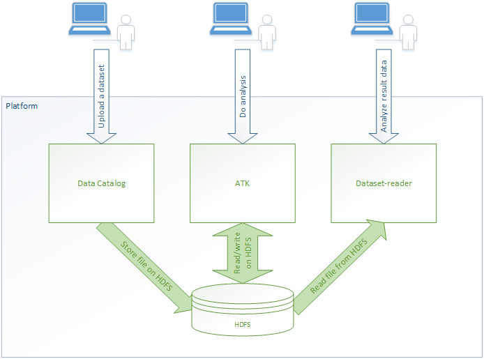

[](https://travis-ci.org/trustedanalytics/dataset-reader-sample)

# Dataset Reader: A Sample Application for Reading a Dataset from HDFS

This project contains a sample application that is able to read a dataset from HDFS and present it in a graphical form to user.

Let's imagine flow as below:



1. Dataset is uploaded through data catalog into the platform. The file is stored on the HDFS
2. Data scientist does some analysis on it using ATK. The result is also stored on HDFS
3. Application developer uploads the dataset-reader application into the platform and binds it with the file.
4. Dataset-reader presents the dataset in a nice form as a set of charts.

## Preparing data

You can either use already prepared dataset, ready to be visualised (see: [Using pre-built dataset](#using-pre-built-dataset)) by the application or go through the whole sample flow and prepare your own dataset using TAP Analytics Toolkit (see: [Preparing dataset manually](#preparing-dataset-manually)).

#### Using pre-built dataset

1. Go to `Data catalog` page
1. Select `Submit transfer` tab
1. Fill in dataset title and choose local file upload
1. Select file to upload (sample dataset can be found here: [data/nf-data-application.csv](data/nf-data-application.csv))
1. Alternatively, you can select upload using a link and specify link to raw file on github (i.e. [nf-data-application.csv](https://github.com/intel-data/dataset-reader-sample/raw/master/data/nf-data-application.csv)
1. Submit transfer
1. When the transfer finishes, a new dataset will be visible in `Data catalog`
1. To acquire link to file on HDFS go to the recently created dataset and copy the value of `targetUri` property. 

#### Preparing dataset manually

To prepare the dataset on you own, follow the steps describe in [Workshop Module 1](workshop/Intel Workshop Module 1 Final.pdf)

## Compilation and running

1. Clone this repository
  
  ```git clone https://github.com/trustedanalytics/dataset-reader-sample.git```
1. Compile it using Maven
  
  ```mvn compile```
1. (Optional) Run it locally passing path to the file

  ```FILE=<path_to_the_file> mvn spring-boot:run -Dspring.profiles.active=local```

## Pushing to the platform

1. Make Java package

  ```mvn package```
1. Login and set proper organization and space
  
  ```
cf api <platform API address>
cf login
cf target -o <organization name> -s <space name>
```
1. (Optional) Change the application name and host name if necessary in the ```manifest.yml```
  
  ```
  name: <your application name>
  host: <application host name>
  ```
  :information_source: For example, if you set host to "dataset-reader" and your platform URL is "example.com", the application will be hosted under 'dataset-reader.example.com' domain.
1. Push dataset-reader to the platform
  
  ```
  cf push
  ```
  
  Application will fail to start anything because it doesn't know which file to serve and how to connect to HDFS.
1. Create HDFS service instance called `hdfs-instance`. You can do that using command line or via browser:
  1. Using CF CLI:
  
    ```
    cf create-service hdfs shared hdfs-instance
    ```
  1. Using WebUI: 
    1. Go to `Marketplace`
    2. Select `HDFS` service offering
    3. Type the name of the instance: `hdfs-instance` (**Note:** the instance must be called `hdfs-instance`)
    4. Click `Create new instance`
1. Bind the `hdfs-instance` to application
  1. Using command line tool:
  
    ```
    cf bind-service dataset-reader hdfs-instance
    ```
  1. Using WebUI:
    1. Go to `Applications` list
    1. Go to details of `dataset-reader` application
    2. Switch to `Bindings` tab
    3. Click `Bind` button next to the `hdfs-instance` (you can use filtering functionality to search for the service)
1. Pass the path to the file on HDFS (acquired in step [Preparing data](#preparing-data)) as a environment variable called "FILE":

  ```
  cf set-env <application name> FILE <path to file on HDFS>
  ```
1. Restart the application to reload the environment variables

  ```
  cf restart <application name>
  ```
